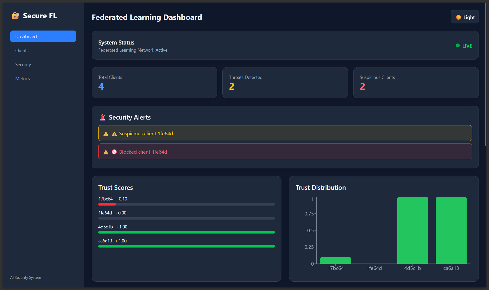
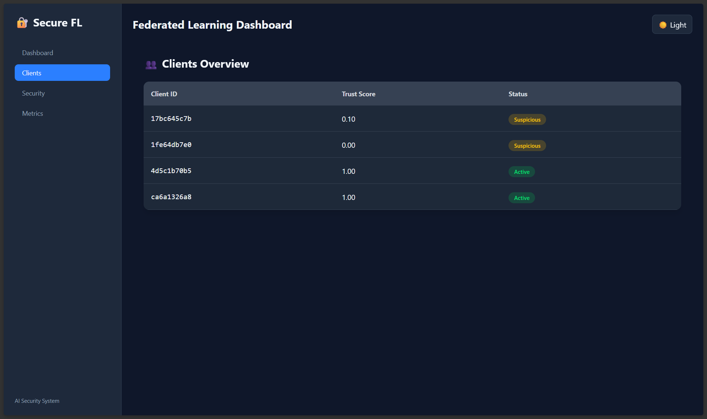
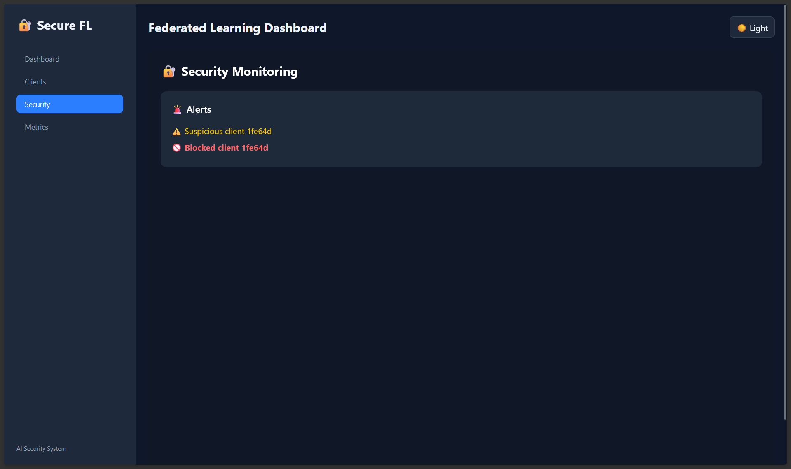
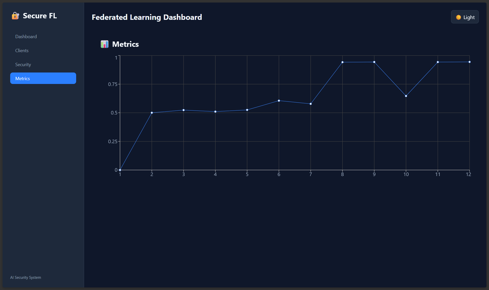

# 🔐 SecureFL — Secure Federated Learning with Byzantine Attack Detection & SOC Dashboard

> A privacy-preserving Federated Learning framework that detects malicious clients using anomaly detection, trust scoring, and rollback protection while providing real-time visibility through a Security Operations Center (SOC) dashboard.


---

# 📑 Table of Contents

* Overview
* Motivation
* Key Features
* Architecture
* Dataset
* Model Architecture
* Threat Model
* Tech Stack
* Project Structure
* Dependency Management
* Installation
* Running the Project
* API Endpoints
* Detection Pipeline
* Trust Management
* Evaluation Metrics
* Dashboard Features
* Results
* Future Improvements
* Screenshots
* Author

---

# 🎯 Overview

SecureFL is a cybersecurity-focused Federated Learning framework designed to defend against malicious participants attempting to poison the global model.

Traditional Federated Learning systems assume clients behave honestly. In real-world deployments, compromised devices may intentionally upload manipulated model updates to degrade model performance or influence predictions.

SecureFL introduces:

* Multi-layer anomaly detection
* Dynamic trust management
* Automatic attacker blocking
* Aggregation rollback protection
* Real-time SOC monitoring dashboard

The framework enables secure collaborative machine learning without requiring clients to share raw data.

---

# 🚀 Motivation

Federated Learning is increasingly used in:

* Healthcare
* Finance
* Mobile devices
* IoT networks
* Smart cities
* Cybersecurity systems

However, these environments are vulnerable to:

* Model poisoning
* Byzantine attacks
* Data poisoning
* Backdoor attacks

SecureFL was developed to explore practical defense mechanisms against such threats while maintaining privacy and scalability.

---

# ✨ Key Features

### 🛡 Byzantine Client Detection

Identifies malicious clients attempting to manipulate the global model.

### 📐 Cosine Similarity Monitoring

Measures divergence between client updates and the global model.

### 🌲 Isolation Forest Detection

Machine-learning based anomaly detection on model weight updates.

### 📊 Historical Z-Score Analysis

Smooths detection results over multiple rounds to reduce false positives.

### 🔒 Dynamic Trust Scoring

Assigns and updates trust values for each client.

### 🚫 Automatic Client Blocking

Clients falling below trust thresholds are excluded.

### 🔄 Rollback Protection

Aggregation rounds are skipped if the majority of participants appear compromised.

### 📡 FastAPI Backend

Provides real-time security telemetry and model metrics.

### 🖥 SOC Dashboard

Interactive monitoring interface built using Next.js and TypeScript.

---

# 🏗 Architecture

```text
                         ┌───────────────────────┐
                         │     Flower Server     │
                         │    SecureFedAvg       │
                         └──────────┬────────────┘
                                    │
             ┌──────────────────────┼──────────────────────┐
             │                      │                      │
             ▼                      ▼                      ▼

     Cosine Similarity      Isolation Forest      Z-Score History
         Analysis           Anomaly Detector        Smoothing

             └──────────────────────┼──────────────────────┘
                                    │
                                    ▼

                           Trust Manager

                                    │
                                    ▼

                              logs.json

                                    │
                                    ▼

                          FastAPI Backend

                                    │
                                    ▼

                        Next.js SOC Dashboard


Clients:
client1  client2  client3  client4  attacker
```

---

# 📂 Dataset

SecureFL uses a phishing and malicious prompt classification dataset.

The dataset contains:

* Legitimate prompts
* Malicious prompts
* Prompt injection examples
* Security-related text samples

## Data Processing Pipeline

```text
Raw Dataset
      │
      ▼
Text Cleaning
      │
      ▼
TF-IDF Vectorization
      │
      ▼
5000-Dimensional Features
      │
      ▼
Client Partitioning
      │
      ▼
Federated Training
```

## Feature Engineering

TF-IDF Vectorizer:

```python
max_features=5000
```

Generated files:

```text
data/
└── processed/
    ├── client1.npz
    ├── client2.npz
    ├── client3.npz
    ├── client4.npz
    └── attacker.npz
```

## Privacy Preservation

Clients never share:

* Raw text
* Original dataset
* Personal data

Only model parameters are transmitted.

---

# 🧠 Model Architecture

SecureFL uses a lightweight PyTorch classifier.

```text
Input Layer
(5000 Features)
        │
        ▼
Linear(5000 → 256)
        │
      ReLU
        │
        ▼
Linear(256 → 128)
        │
      ReLU
        │
        ▼
Linear(128 → 2)
        │
     Softmax
```

## Training Configuration

| Parameter     | Value            |
| ------------- | ---------------- |
| Optimizer     | Adam             |
| Loss Function | CrossEntropyLoss |
| Features      | TF-IDF           |
| Aggregation   | SecureFedAvg     |
| Framework     | PyTorch          |

---

# ⚠ Threat Model

SecureFL focuses on detecting:

## Byzantine Attacks

Clients send arbitrary model updates.

## Model Poisoning

Malicious updates attempt to corrupt the global model.

## Gradient Poisoning

Attackers manipulate gradients before transmission.

## Backdoor Injection

Attempts to introduce hidden behaviors.

---

# 🛡 Detection Pipeline

Each round passes through multiple security checks.

## Layer 1 — Cosine Similarity

Measures update similarity.

```text
Low similarity → Suspicious
```

---

## Layer 2 — Isolation Forest

Detects abnormal weight distributions.

```python
IsolationForest()
```

Prediction:

```text
1   = Normal
-1  = Anomaly
```

---

## Layer 3 — Z-Score History

Tracks client behavior over previous rounds.

```text
Average Z-score < Threshold
```

Triggers anomaly flag.

---

# 🔒 Trust Management

Each client starts with:

```text
Trust = 1.0
```

### Suspicious Behavior

```text
trust -= 0.5
```

### Normal Behavior

```text
trust += 0.05
```

### Block Threshold

```text
trust < 0.30
```

Client becomes:

```text
BLOCKED
```

---

# 🔄 Rollback Protection

If:

```text
Suspicious Clients > 50%
```

The aggregation round is skipped.

This prevents poisoned updates from entering the global model.

---

# 🧰 Tech Stack

| Layer               | Technology       |
| ------------------- | ---------------- |
| Federated Learning  | Flower           |
| Deep Learning       | PyTorch          |
| Anomaly Detection   | Isolation Forest |
| Backend             | FastAPI          |
| Server              | Uvicorn          |
| Dashboard           | Next.js          |
| Language            | TypeScript       |
| Styling             | TailwindCSS      |
| Charts              | Recharts         |
| Data Processing     | Pandas           |
| Numerical Computing | NumPy            |

---

# 📁 Project Structure

```text
SecureFL/
│
├── backend/
│   ├── anomaly_detector.py
│   ├── api.py
│   ├── fl_server.py
│   ├── preprocess.py
│   ├── security.py
│   ├── train_local.py
│   ├── trust_manager.py
│   ├── requirements.txt
│
├── clients/
│   ├── attacker.py
│   ├── client1.py
│   ├── client2.py
│   ├── client3.py
│   ├── client4.py
│   ├── model.py
│   └── utils.py
│
├── data/
│   ├── MPDD.csv
│   └── processed/
│       ├── client1.npz
│       ├── client2.npz
│       ├── client3.npz
│       ├── client4.npz
│       └── attacker.npz
│
├── soc-dashboard/
│   ├── app/
│   ├── components/
│   ├── lib/
│   ├── eslint.config.mjs
│   ├── next-env.d.ts
│   ├── next.config.ts
│   ├── package.json
│   ├── package-lock.json
│   ├── postcss.config.mjs
│   └── tsconfig.json
│
├── .gitignore
├── LICENSE
├── README.md
```

---

# 📦 Dependency Management

## Backend

Install:

```bash
pip install -r backend/requirements.txt
```

### Core Dependencies

```text
flwr
torch
scikit-learn
numpy
pandas
fastapi
uvicorn
```

---

## Frontend

Install:

```bash
cd soc-dashboard

npm install
```

### Core Dependencies

```text
next
react
react-dom
typescript
axios
recharts
tailwindcss
```

---

# ⚙ Installation

## Prerequisites

- Python 3.10 or later
- Node.js 20 or later
- npm

---

## Clone Repository

```bash
git clone https://github.com/yourusername/SecureFL.git

cd SecureFL
```

---

# 🚀 Running the Project

## 1. Preprocess the Dataset

Before starting the federated learning system, preprocess the dataset to generate the client-specific training files.

```bash
cd backend

python preprocess.py
```

This generates the processed datasets inside:

```text
data/
└── processed/
    ├── client1.npz
    ├── client2.npz
    ├── client3.npz
    ├── client4.npz
    └── attacker.npz
```

> This step only needs to be performed once unless the dataset changes.

---

## 2. Start Backend

```bash
cd backend

uvicorn api:app --reload
```

Starts the SecureFL backend and exposes the REST API at
```text
http://localhost:8000
```

---

## 3. Start Clients

Run each client in a separate terminal.

```bash
cd clients

python client1.py
python client2.py
python client3.py
python client4.py
```

Optional attacker:

```bash
python attacker.py
```

---

## 4. Start Dashboard

In a new terminal:

```bash
cd soc-dashboard

npm install

npm run dev
```

Runs on:

```text
http://localhost:3000
```

---

# 🔌 API Endpoints

| Endpoint     | Description         |
| ------------ | ------------------- |
| GET /alerts  | Security alerts     |
| GET /trust   | Client trust scores |
| GET /metrics | Training metrics    |
| GET /health  | Backend status      |

Example:

```bash
curl http://localhost:8000/trust
```

---

# 📊 Dashboard Features

### Main Dashboard

* Security overview
* Active alerts
* Trust monitoring

### Clients View

* Trust scores
* Client status
* Blocked clients

### Metrics View

* Accuracy
* Precision
* Recall
* F1 Score
* Attack Success Rate

### Security Events

* Alert history
* Detection logs
* Attack timelines

---

# 📈 Evaluation Metrics

| Metric    | Description               |
| --------- | ------------------------- |
| Accuracy  | Model correctness         |
| Precision | Correct attack detections |
| Recall    | Attack detection rate     |
| F1 Score  | Precision-Recall balance  |
| ASR       | Attack Success Rate       |

Goal:

```text
High Accuracy
High Precision
High Recall
Low ASR
```

---

# 🎯 Results

SecureFL successfully:

✅ Detected malicious clients

✅ Reduced attack success rate

✅ Maintained model accuracy

✅ Prevented poisoned aggregations

✅ Provided real-time security monitoring

---

# 🔮 Future Improvements

* Differential Privacy (DP-SGD)
* Secure Aggregation Protocols
* Blockchain-based Trust Management
* Non-IID Dataset Support
* Docker Deployment
* Kubernetes Scaling
* Explainable AI for Attack Detection
* Historical Analytics Dashboard
* Multi-Attacker Simulation

---

# 📸 Screenshots






---

# 👨‍💻 Author

**Harpreet Singh**

Mathematics and Computing Engineering
Dr. B. R. Ambedkar National Institute of Technology, Jalandhar

Interests:

* Federated Learning
* Cybersecurity
* Distributed Systems
* Artificial Intelligence
* Privacy-Preserving Machine Learning

---

⭐ If you found this project useful, consider giving it a star on GitHub.
